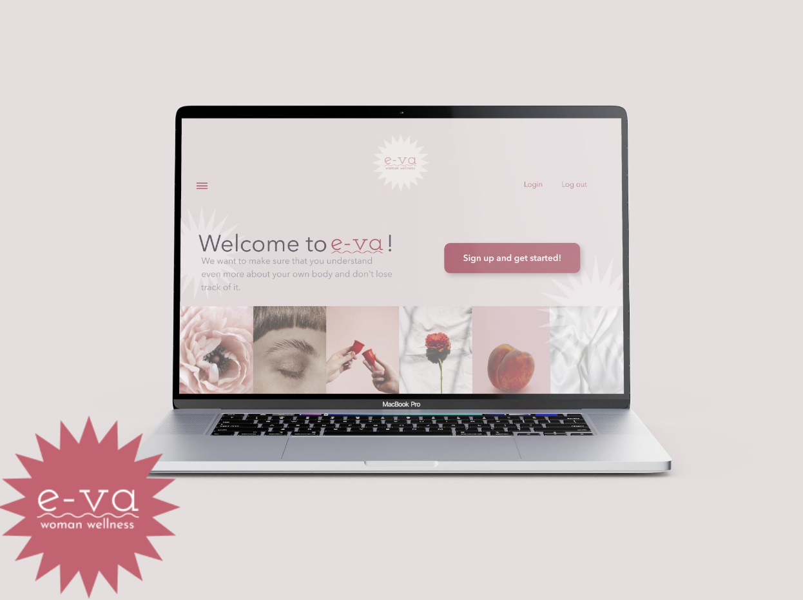
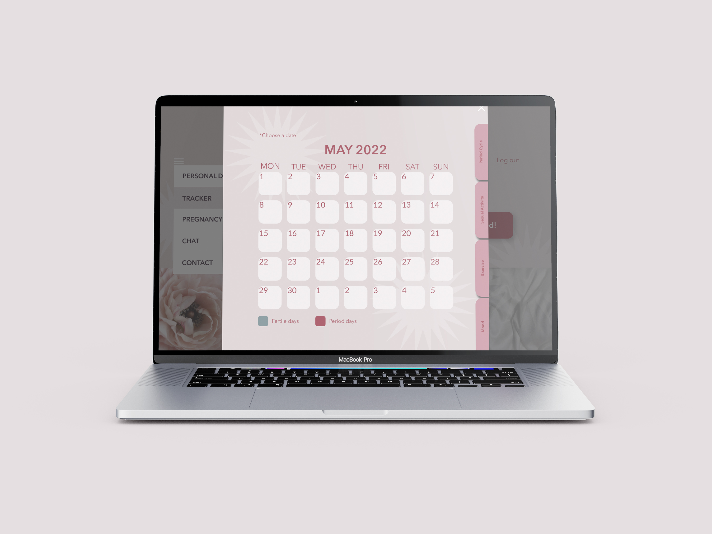
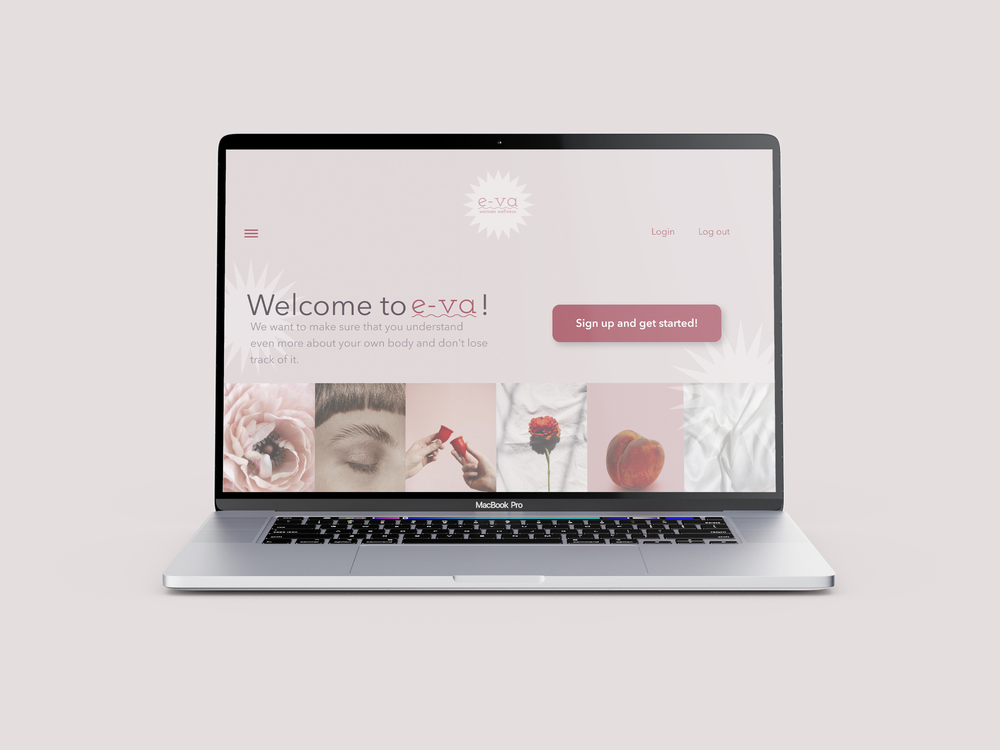
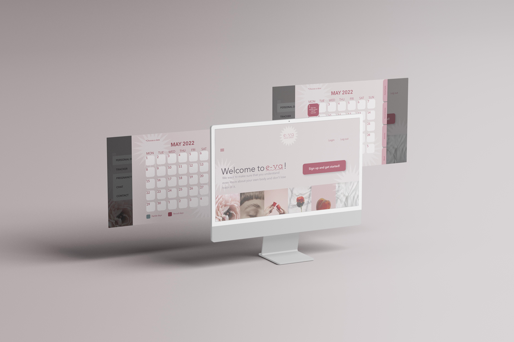

# E-va

# JUL // 2022 - TechLabs Berlin Summer Semester

# TEAM:

- WD - Track: Omar Brato and Sneha Ghag

- UX - Track: Andiara Roses

- Team Mentor: Soma Hargitai

# The Idea:

E-va, is a comprehensive women's wellness desktop App with features such as period tracking, mood tracking, and a health library. E-va's focus is to enable women to become increasingly aware of their health and wellness to empower them by using the data to correctly calculate their menstrual cycle. Through an interactive calendar, women can analyze their data, compare them monthly, and can identify specific patterns to detect any change that may serve as an alert for them to see a doctor.

This project was certainly a great challenge for our team consisting of only 2 WD - Techies and 1 from UX - Track. It was a period of intense learning both in the academic phase and in the project phase. We take this opportunity to immensely thank our mentor who helped us during this journey and was always available to answer our questions. Without him, we wouldn't have gotten this far.

# The Problem:

Currently, there are many online platforms where a woman can track the status of her personal and intimate health, but many only cover one isolated aspect of the topic and others require the payment of extra fees for the release of exclusive content. The central idea of this project would be to create a single platform capable of covering most aspects of a woman's health so that she becomes increasingly aware of how her body works.

According to research conducted by McKinsey and Company in April 2021, it was clear that consumers care deeply about wellness and that their interest is growing. The survey was conducted with 7500 consumers in six countries: 79% said they believe that wellness is important. 42% consider it a top priority.

## How do consumers define wellness?

● Better health.

● Better fitness.

● Better nutrition.

● Better appearance.

● Better sleep.

● Better mindfulness.

# UX - Process

The UX process began with Market Research, a Competitive Analysis, and the development of a questionnaire for subsequent interviews. From the interview, it was possible to define the profile of potential users and create personas, scenarios empathy maps, and journey maps. It was verified that there are a priori two main groups of women who could be interested in the E-va Web app:

● Women who would like to inform themselves more effectively about topics related to women's health and who would like to more actively analyze their own menstrual cycle in order to identify possible patterns that can be influenced by daily habits such as exercise and sexual activity.

● Women who are seeking to become pregnant and are looking for a platform that can help them both pre-pregnancy and during pregnancy.

_Picture 1: UX - Process main steps_

From this user-centered research, it was possible to answer questions such as:

● Who our users are?

● Why will people visit us?

● What should our website accomplish?

# UI - Design

_Picture 2 and 3 : UI Design overview_

This design was inspired by a paper planner, almost as if the app acted as a user's notebook/diary. The color palette, which was inspired by a picture board, is composed of colors that alternate from lighter and neutral tones to stronger ones. The fonts used are delicate and clear in order to be easily identified and legible.

# User Testing

A User Test was conducted with 7 potential users (women in the 18-40 age range) with this number we expected to be able to uncover the most common issues and learn how our designs perform. In this case, the main task to be performed by each was:

● Access the main page of the E-va webapp.

● Create an account.

● Answer the questionnaire.

● And access the tracker/calendar (E-va's main feature).

The online platform Maze was used to perform this user research step.

# Conclusion - UX Track

Being part of a project like this considering our inexperience was quite challenging, especially since we had a very small team. I personally feel that I was able to learn from my mistakes, and now coming to the end of this stage I consider that my work still has many flaws that should be corrected in the future, but the simple fact of being able to identify them and have an idea of which way to go to correct them makes me sure that I'm on the right track.

# WD - Process

# FRONTEND

Seeing our idea turn into a live project felt very rewarding. After our initial brainstorming sessions with Andi from UI and our mentor Soma, we chalked our frontend strategies and hosted our project locally. We used MUI library to create and use cool components to make our website interactive.

Initial hardships were mostly styling MUI components per UI design recommendations & working with JavaScript. With our mentor’s immense support, we were able to improve our codes. One of the most important lesson learnt was attention to detail. We realized how a small punctuation mark can lead to a sudden malfunction.

After a lot of hue & cry, we were able to learn if not master many difficult JavaScript codes. The whole learning process has been invaluable. From watching videos to working on codes real-time was very gratifying. We are immensely proud to present our website, which looks quite like the UI provided recommendations. Having said that, we still feel there is a lot to learn when it comes to mimicking designs, because the sky is the limit!

# SHORTFALL

Our glorious project couldn’t replicate the exact idea & pitch proposed idea due to limited resources and a compact team. At this moment, we have a firebase backend setup, but the functionality is a bit limited. Building a responsive & server-side of the website could come at a later stage.

# CONCLUSION

We felt empowered every single day because of our mentor. He never let us feel incompetent and in fact made every failure into a learning process. We learnt many cool tricks & educated ourselves to use github and mui library. Our mentor made sure that he shared some new blogs or code intermittently to keep us abrest of the technologies.

We are very proud of our skill development during this project phase and are happy to present the little something we could do with our project! :)
