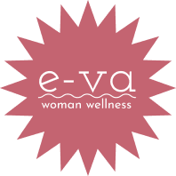

# st22-e-va
# st22-e-va

E-VA is a comprehensive women's wellness desktop App with features such as period tracking, mood & symptom tracking, as well as a health library.

Our aim is to enable women to become increasingly aware of their health and wellness.

Through an interactive calendar, women can analyze their data, compare them monthly, and can identify certain patterns to detect any change that may serve as an alert for them to see a doctor.

# Resources

[Flo-health](https://flo.health/) - used to understand the site functionality and user interface.

[Ovia App](https://www.oviahealth.com/apps/) - used to research features and set milestones for our project.

[Slack channel](https://join.slack.com/share/enQtMzgxMjMwNjYwMDQyMi04NzYzYTE5MzUyNTNhMTBkMGVkZjdhOTkxMjYzZDA1ZmM5NDJmMDA2ZjFlYWYwMjRmNjdlNjMzMDFlMmZmOGRj) for internal communication.

# UI Resources

- E-va [Figma prototype](https://www.figma.com/proto/TiA9UZStj5QIaA6ljHyjVS/E-va-Desktop?page-id=0%3A1&node-[…]le-down&starting-point-node-id=127%3A7764&show-proto-sidebar=1)
- E-va [UX research](https://www.notion.so/UX-E-va-Research-c5c70cd409994edc87b2b8549d3b8a8e)

# Setup

- Clone repository
- Frontend Development

npm start starts a development server on port 3000 with support for live code reloading.

Run this in the /frontend directory (cd EvaApp).

It should open the browser at http://localhost:3000 automatically.

Go to http://localhost:3000/homepage to view E-va Desktop App.

## Lessons

1. JavaScript is no joke! Building something for the first time is very difficult. Without out mentor, Soma, everything seemed blur.
   With the right guidance and realistic goals, we were able to create a lot of beautiful landing pages.

2. Using MUI library has been an excellent learning curve. Being one of the most comprehensive libraries, with MUI we were able to build excellent components based on UI recommendations.

3. Github is not as overwhelming as it seems! We were soon able to use git commands flawlessly.

## Contributors

- [@SnehaGhag](https://github.com/SnehaGhag)
- [@OmarBrato](https://github.com/brato3)
- [@AndiRosés](https://github.com/andiroses)

## Mentor

- [Soma Hargitai](https://github.com/somahargitai)

